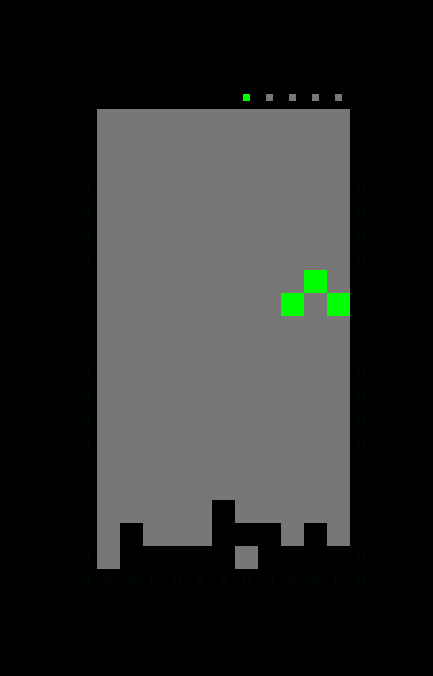
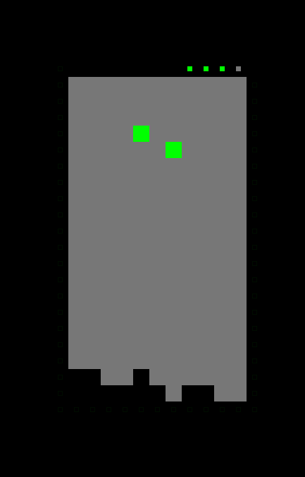
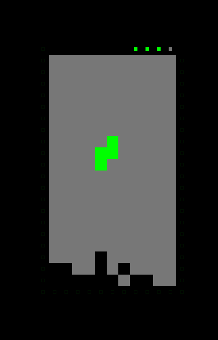
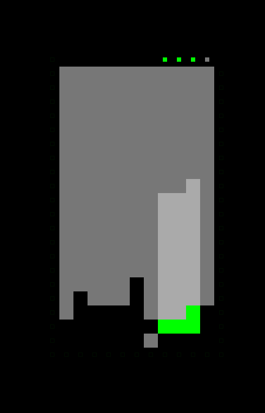
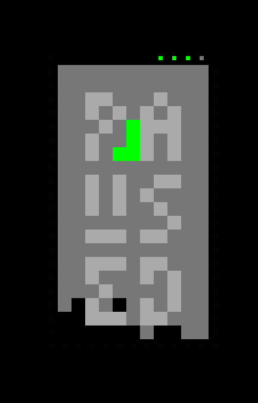
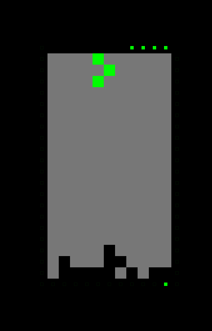

# nerdy contre-jour tetris

keys are:

 - p     - pause and unpause.
 - hjkl  - move and turn.
 - r     - restart.
 - space - make shape go fast.

it's more of an art work than an actual game.

NOTE: the game includes shapes with more and less than 4 bricks, therefore it's
not strictly tetris, but more of n-tris (with n > 0).

NOTE: yes, your score at the top is in binary.

## demos

(||||
|:---:|:---:|:---:|
||||)

